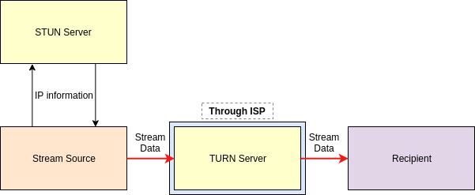
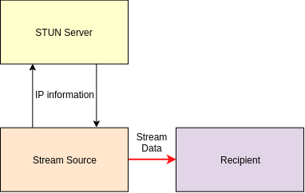

# (dis)connect

A WebRTC project bringing low-latency to a dance performance involving many
simultaneous live-streams.
The audience can connect to a webpage that will allow them to stream from their
phone to a computer backstage.
This computer will manage the connections and either record the streams or
upload them as live video.
The system was designed to take advantage of the locality of all the devices:
since all devices are on the same network, the latency can be greatly reduced by
using local connections through the router, avoiding ISP bandwidth-throttling,
which I've diagrammed below.

<p align="center">
 
</p>

Here is a diagram of a possible WebRTC connection over remote networks. Notice
how all of the stream information needs to be communicated to a TURN server
and relayed to the recipient afterwards. This involves communicating the large
stream data twice through an ISP-constrained connection.

<p align="center">
 
</p>

Here is a diagram of a WebRTC connection locally. See how there is no longer a
need to relay the connection through TURN, only communicating the stream data
once. Also, the connection to the recipient can be done simply through the
router, avoiding the ISP's bottleneck.

This project was deployed for Jo B Dance's premiere choreography performance
in Seattle on May 6th and 7th, 2019.
There are also plans in the making to bring this performance and web
application to Utah in 2020.

## Getting started

This application was created on a Linux machine. This application is untested on
other OS (it might work on Mac but I have my doubts about windows). To set
up this application, you will need:
* [npm][npm_link] 
* A domain name you own (free domains available at [www.dot.tk][link_tk])
* An HTTPS certificate for that domain name (free using [Let's Encrypt][link_letsencrypt])
* [nginx][link_nginx] (or any software to create a webserver)

In my setup for local connections, I set my domain to resolve to a local IP address
(i.e. 192.168.1.X) and configured a static IP for a computer which would run the server.
In order to get an HTTPS certification for a local IP, you need to use Let's Encrypt's
DNS certification method (as opposed to HTTP).
This command begins the DNS certification process I used through Let's Encrypt.
```
certbot -d www.mywebsite.com --manual --preferred-challenges dns certonly
```

Note: The project is set-up by default to use public STUN and TURN services. There
are security vulnerabilities to this(particularly TURN) and if you are interested in
hosting your own STUN/TURN, it is incredibly simple using [coturn][link_coturn].

## Set-up

You'll need a website to host this service on. I recommend nginx because I found
it reliable and easy to begin with. I found [this tutorial][link_nginx_help]
to be a helpful and speedy nginx intro. I've included my simple server config in
the repo as nginxserver.config.example.

After cloning the repo and obtaining a domain with certification, you'll need to
edit two files.

First, open ProjectInfo.ts.example.
You will need to type in your domain information as well as the location of
your HTTPS certificates.
Note that there is a boolean variable specifying if the clients and host are all
on the same internet network.

Second, open project_info.sh.
Type in the location of your website's directory so that the files can be
deployed to the website.
Close both files and rename them to exclude the ".example" suffix.

Now open the repo and run

```
npm install
```

This will install all of the required packages to run the server,
compile TypeScript, etc.

Next run

```
npm run build
```

Now your web app will be ready-to-go!

## Usage

Open the repo and run

```
npm start
```

This will start the signalling server and new connections to the website will
be connected to the server as well.

Open *your website*/controller, *your website*/preshowvideo,
*your website*/projector, and *your website*/streamHost. I'll list the
functionalities and uses of each page in the performance below. Please
note that streaming will only function if the recipient ("projector" or
"streamHost") is open.

* If you press "Begin Stream", the screen will be replaced by the device's camera.
If you navigate to "projector", you will see the same camera stream on that page.
Tapping on the video in "controller" will stop the stream. This was used in the show
to show the audience a live-stream on the projector as they were informed of their role
in streaming the performance.

* If you press "Allow Streaming", "preshowvideo" will display a button. Upon
pressing the button, the screen will be replaced with the device's camera. In
"streamHost", one of the 9 videos will be replaced by the camera's feed. Once 10
streams have been added, the screen will occasionally replace on-screen streams with
off-screen streams. This was used in the performance to allow the audience to stream
their perspective to a local machine that could stream to a live audience over Twitch.
This was the biggest bridge between perspective and technology (the two themes of the
show) and had a really powerful result.

* If you press "Play Video", "preshowvideo" will no longer be a black screen; it will now
be playing an embedded video. Refreshing the page and opening the page on other devices
reveals that the video is synced to display this embedded video as a "live" video, where
all devices' playback is synced. This was used in the show at the start to give the audience
a surreal experience because the video was taken of the performance space they were in
a few days beforehand. The audience would end up questioning if watching the same
performers perform on the same stage while they sit in the same seat is the same
performance even though they are watching on their phone.

* If you press "Blackout", the video playing on "preshowvideo" will be replaced
with a black screen. This was used to stop the video and bring the audience's
attention back into the physical world. If "Play Video" is pressed afterwards,
you'll notice that the video playback has continued while not visible.

* If you press "Reset", the video on "preshowvideo" will stop and disappear and the playback
time will be reset. The streaming button on "preshowvideo" will alsop disappear.

## Built With

* [WebRTC][link_webrtc]
 - The framework to send and receive live video data
* [WebSockets][link_ws]
 - The library used for the signalling server
* [Node.js][link_nodejs]
 - Used to run the backend signalling server
* [ES Lint][link_eslint]
 - TypeScript correctness linter
* [Prettier][link_prettier]
 - TypeScript aesthetic linter
* [WebPack][link_webpack]
 - Used to package TypeScript into JavaScript

## Acknowledgments

Many thanks to [developer.mozilla.org/en-US/docs/Web/API/WebRTC_API/Simple_RTCDataChannel_sample][link_mozilla_dc]
and other WebRTC tutorials I used.

I also found the diagrams on [https://www.pkc.io/blog/untangling-the-webrtc-flow/][link_webrtc_flow]
to be a fantastic help.

I created the diagrams on this page using [draw.io][link_drawio], a
great diagramming tool.

[link_npm]: https://www.npmjs.com/
[link_tk]: http://www.dot.tk
[link_letsencrypt]: https://letsencrypt.org
[link_nginx]: https://www.nginx.com
[link_coturn]: https://github.com/coturn/coturn
[link_nginx_help]: https://linuxize.com/post/how-to-set-up-nginx-server-blocks-on-debian-9/
[link_webrtc]: https://webrtc.org/
[link_ws]: https://github.com/websockets/ws
[link_nodejs]: https://nodejs.org
[link_eslint]: https://eslint.org/
[link_prettier]: https://prettier.io/
[link_webpack]: https://webpack.js.org/
[link_mozilla_dc]: https://developer.mozilla.org/en-US/docs/Web/API/WebRTC_API/Simple_RTCDataChannel_sample
[link_webrtc_flow]: https://www.pkc.io/blog/untangling-the-webrtc-flow/
[link_drawio]: https://www.draw.io/
